# Entity Relationship Diagram (ERD)
## AI Personal Health Coach — 57 Tables Across 11 Modules

| | |
|---|---|
| Document | 02-ERD.md |
| Source of truth | [database-schema/mysql.sql](../database-schema/mysql.sql) — if this document and the SQL ever disagree, the SQL wins |
| Companion | [database-schema/erd.dbml](../database-schema/erd.dbml) — import at dbdiagram.io for an interactive visual diagram |
| Field-level detail | [03-Database-Dictionary.md](03-Database-Dictionary.md) |

This document shows the schema as diagrams grouped by module, since a single 57-table diagram is unreadable. Each diagram is valid Mermaid (`erDiagram`) and renders directly in GitHub/VS Code preview. Cross-module foreign keys are listed in §12.

---

## 1. Core / Auth / RBAC

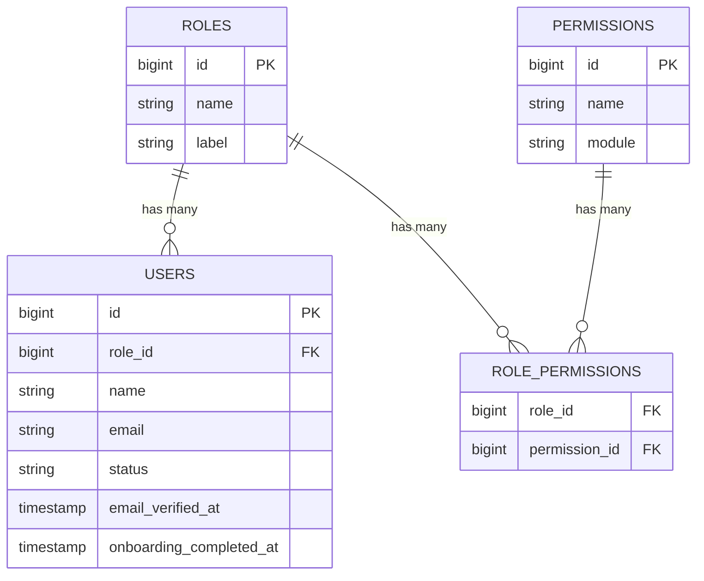

---

## 2. AI Provider Layer

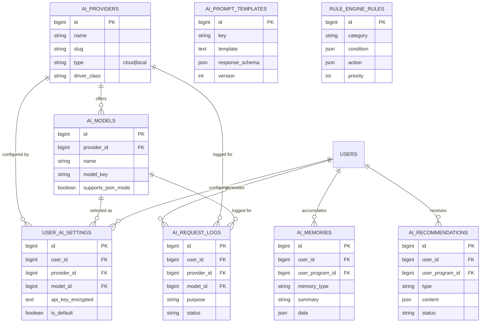

> Note: `AI_PROMPT_TEMPLATES` and `RULE_ENGINE_RULES` are standalone reference tables (no inbound FK) consumed by application services, not joined directly — shown here for module cohesion.

---

## 3. Knowledge Base

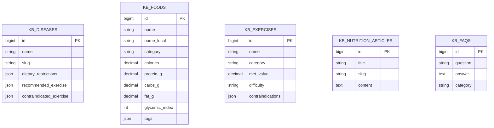

`kb_diseases` is referenced by `user_diseases` (Module 4) and by `kb_exercises.contraindications` / `kb_foods.tags` at the application layer (slug lookup, not enforced FK, since these are array fields).

---

## 4. Health Profile

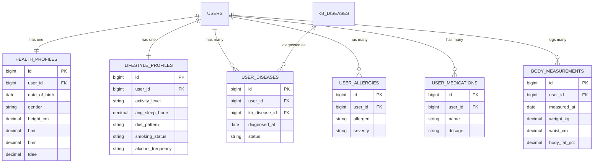

---

## 5. Onboarding

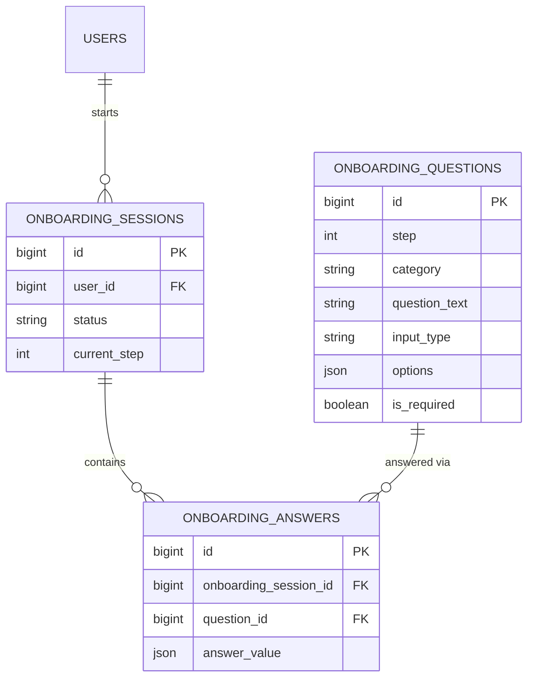

---

## 6. Program (the core domain)

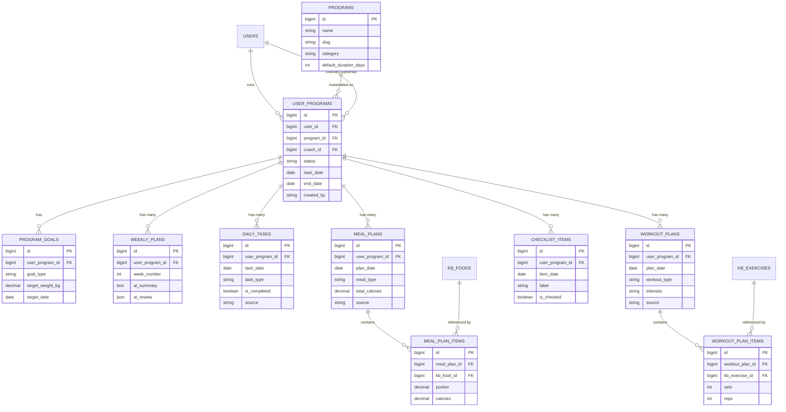

`reminders` (per-user, not per-program) is covered in the Database Dictionary but omitted from this diagram to avoid clutter — it FKs to `users.id` only.

---

## 7. Progress Tracking

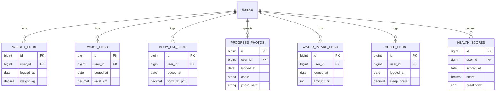

---

## 8. Coach

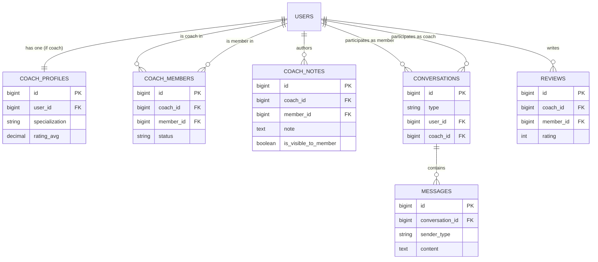

---

## 9. Analytics / Gamification

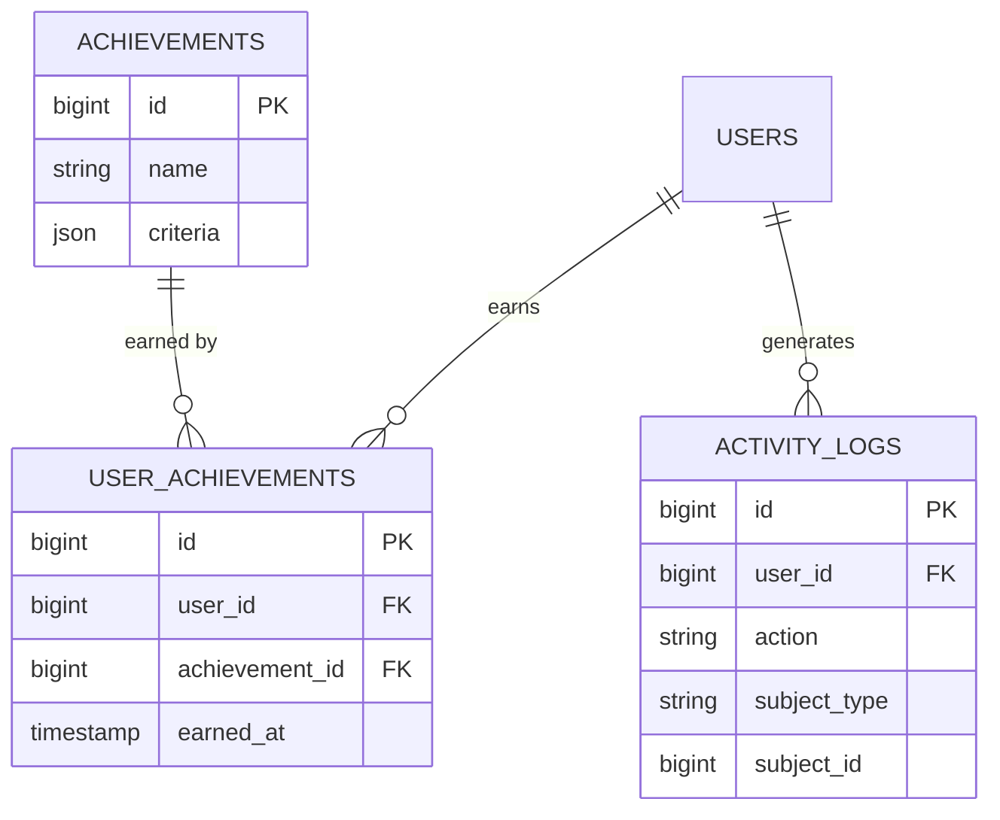

---

## 10. Subscription / Billing

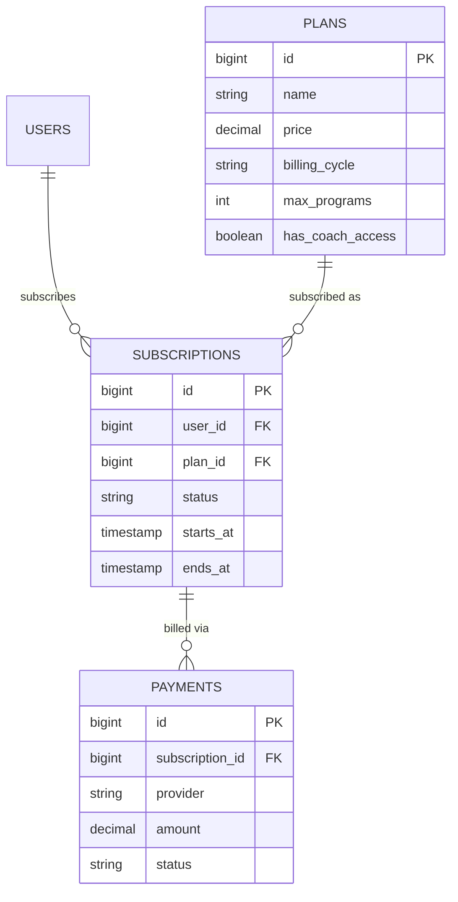

---

## 11. App Settings

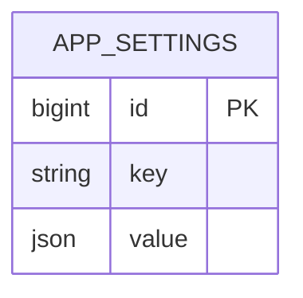

Standalone key-value store; no FKs.

---

## 12. Cross-Module Foreign Key Index

For quick lookup — every FK that crosses the module boundaries above:

| From table | Column | To table |
|---|---|---|
| `ai_memories` | `user_program_id` | `user_programs.id` |
| `ai_recommendations` | `user_program_id` | `user_programs.id` |
| `ai_recommendations` | `reviewed_by` | `users.id` |
| `user_diseases` | `kb_disease_id` | `kb_diseases.id` |
| `meal_plan_items` | `kb_food_id` | `kb_foods.id` |
| `workout_plan_items` | `kb_exercise_id` | `kb_exercises.id` |
| `user_programs` | `coach_id` | `users.id` |
| `coach_members` | `coach_id`, `member_id` | `users.id` (both) |
| `conversations` | `coach_id` | `users.id` |

## 13. Cardinality Notes

- `users` ↔ `health_profiles`, `users` ↔ `lifestyle_profiles`, `users` ↔ `coach_profiles`: **1:1** (a coach profile only exists for users with role = coach; enforced at application layer, not DB constraint, to keep `users` role-agnostic).
- `users` ↔ `user_programs`: **1:N** — a Member can run multiple programs concurrently (FR-PROG-01).
- `user_programs` ↔ `meal_plans`/`workout_plans`/`daily_tasks`/`checklist_items`: **1:N**, partitioned by date — these are the day-by-day generated content of a program.
- `kb_foods`/`kb_exercises` ↔ plan items: **1:N**, nullable — AI may suggest an item not yet catalogued in the KB (`custom_name` used instead), which is a signal for Admin to add it to the KB (see [08-Knowledge-Base.md](08-Knowledge-Base.md) §6 curation loop).
